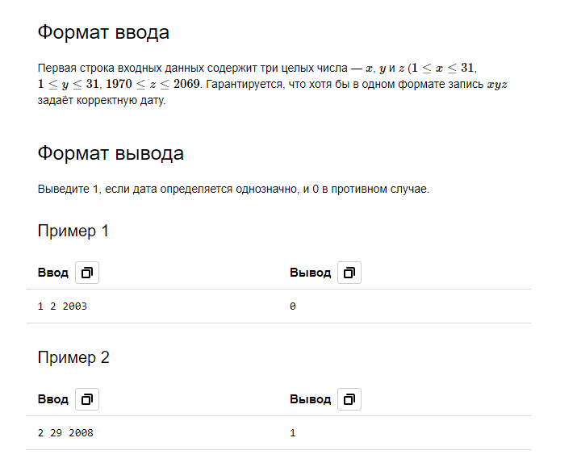

# [C. Даты](https://contest.yandex.ru/contest/28730/problems/C/?success=52878950#7/2019_12_14/Q13Dgfydvk)

- Ограничение времени	2 секунды
- Ограничение памяти	512Mb
- Ввод	стандартный ввод или input.txt
- Вывод	стандартный вывод или output.txt

Как известно, два наиболее распространённых формата записи даты — это европейский (сначала день, потом месяц, потом год) и американски (сначала месяц, потом день, потом год). Системный администратор поменял дату на одном из бэкапов и сейчас хочет вернуть дату обратно. Но он не проверил, в каком формате дата используется в системе. Может ли он обойтись без этой информации?
Иначе говоря, вам даётся запись некоторой корректной даты. Требуется выяснить, однозначно ли по этой записи определяется дата даже без дополнительной информации о формате.

## Примечания
- В первом примере при одной системе записи дата равна 1 февраля, при другой - 2 января 2003 года, то есть однозначно назвать дату не получается.
- Во втором примере корректный вариант даты может быть только в американском формате, где она задаёт 29 февраля 2008 года.
